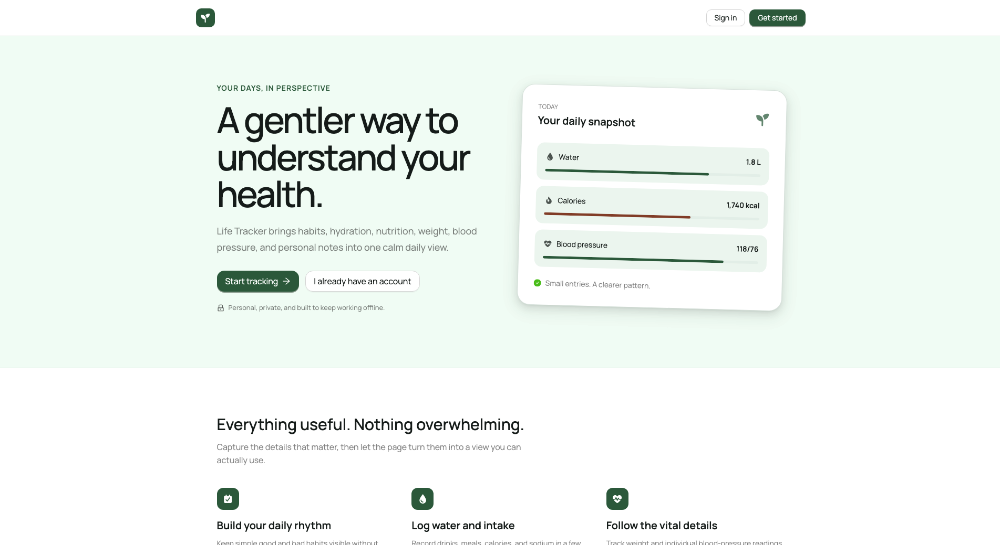

# Life Tracker

**A private health-tracking web app I use as my browser homepage.** Open a tab,
log the day — weight, blood pressure, water, habits — and watch the trends.
Designed, built, and maintained solo with Next.js, React, TypeScript, and Firebase.

🔗 **Live:** [life.boseriko.com](https://life.boseriko.com) — create an account and
it's yours; every account only ever sees its own data.



---

## What this project demonstrates

- **End-to-end ownership** — product design, UI, data modelling, auth, security
  rules, and CI, all built and maintained by one person.
- **Real-time state that stays consistent** — every panel subscribes to Firestore
  live, and a per-field write-tracking layer means two edits to the same day
  (a morning weigh-in, an afternoon BP reading) merge instead of overwriting.
- **Attention to the browser** — SSR-safe theming and breakpoints with no
  hydration mismatches, heavy libraries code-split out of the initial bundle, and
  autosave that survives navigation.
- **Security at the right layer** — per-user Firestore rules are the real
  boundary (not the client route guard), deployed through CI with no secrets in
  the repo.
- **A consistent quality bar** — strict TypeScript, ESLint, and a passing
  production build on every change.

---

## Features

- **One-screen daily log** — weight, blood pressure (systolic/diastolic + posture
  + arm + auto-stamped time), water, notes, and habit checkboxes.
- **No save button** — edits autosave 2 seconds after you stop typing; a header
  status pill moves through *Auto-saving → Unsaved changes → Saving… → Save failed*.
- **Any date** — `◀ / ▶ / Today` plus a picker; the form always reflects what's
  stored for the selected day, past or future.
- **Trends** — a line chart for weight, blood pressure, or water over
  7D / 30D / 90D / 1Y / All, or a custom date range.
- **Averages** — rolling means with change-vs-previous-period, over a window you
  pick (remembered between visits).
- **Habits** — a GitHub-style contribution calendar grouped into Hygiene and
  Junk, with a consistency figure per habit.
- **Personal targets** — set min/max "ideal" ranges; averages and live inputs
  flag out-of-range values with a badge, colour, and a short guidance tooltip.
- **Water presets** — name your bottles and glasses once; they become the
  quick-add buttons.
- **PDF export** — a floating button generates a formatted report: summary stats
  plus a full day-by-day table.

---

## Built with

| | |
| --- | --- |
| **Framework** | Next.js 16 (App Router, Turbopack), React 19 |
| **Language** | TypeScript (strict) |
| **UI** | Ant Design 6, a custom sage-green theme, Newsreader + Manrope |
| **Charts / PDF** | `@ant-design/charts`, `jsPDF` + `jspdf-autotable` (both lazy-loaded) |
| **Backend** | Firebase — Auth (email/password + Google) and Cloud Firestore |
| **Tooling / CI** | ESLint 9, GitHub Actions (auto-deploys the Firestore rules) |

---

## Implementation notes

**Conflict-safe writes.** Each day is one Firestore document keyed by the local
date. Writes are `merge` patches, and the form tracks which fields the user
actually touched in the current session — only those are sent. So autosaving a
weight entry never wipes that day's notes or habit flags, and the blood-pressure
timestamp is stamped only when the BP numbers themselves change.

**Autosave.** `onValuesChange` → debounce (2s) → flush. A pending flush also runs
on unmount, so navigating away never loses an edit. Save state lives in a small
React context, which is how the header pill reflects it from outside the form.

**Hydration-safe theming.** Light/dark is read through `useSyncExternalStore` with
a deterministic server snapshot, so the server and first client render always
agree — no hydration warning, no theme flash. The mode ignores the OS setting,
defaults to light, and persists to `localStorage`.

**Bundle size.** The chart library loads on mount (`ssr: false`); the PDF stack
loads only when the user clicks download. Neither is in the initial JavaScript.

**Security rules without secrets.** `firestore.rules.template` is committed and
contains no owner identity — access is `request.auth.uid == userId` on
`/users/{userId}/**`, and everything else is denied. A GitHub Action deploys it
via `firebase-tools` on every push to `main`.

**Responsive layout.** A CSS `auto-fit` / `minmax` grid collapses its columns
with no media queries; the one spot that genuinely needs a breakpoint (the
header) uses `Grid.useBreakpoint()` so the desktop markup stays untouched.

---

## Run it locally

```bash
npm install
npm run dev      # http://localhost:3000
npm run build    # production build
npm run lint
```

`NEXT_PUBLIC_FIREBASE_*` in `.env.local` holds the client Firebase config (public
by design). `npm run rules:build` compiles `firestore.rules` from the template.
